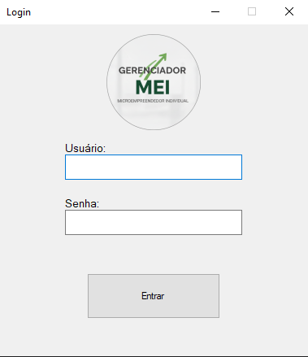
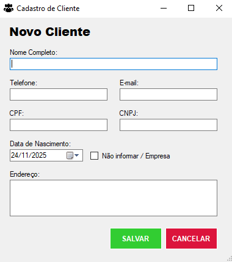
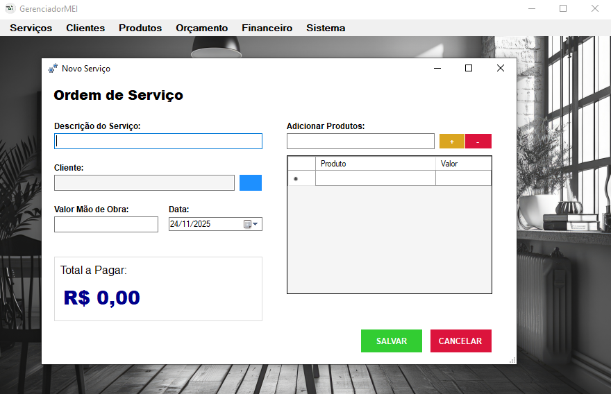
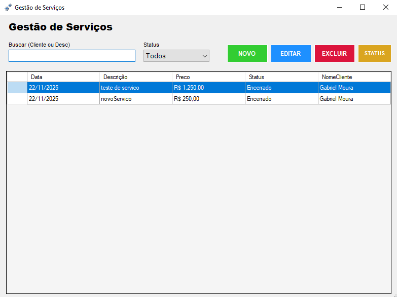

# Gerenciador MEI 🚀


> Um sistema de gestão simples e eficiente focado no Microempreendedor Individual (MEI).


*Tela inicial do sistema*

## 💻 Sobre o Projeto

O **Gerenciador MEI** é uma aplicação Desktop desenvolvida em **C#** com o objetivo de facilitar a rotina administrativa de pequenos negócios. O sistema permite o controle de clientes, serviços e orçamentos de forma intuitiva.

O projeto foi desenvolvido como parte de estudos em desenvolvimento de software, aplicando conceitos de Orientação a Objetos e banco de dados.

## 📸 Galeria

Aqui estão algumas telas do sistema em funcionamento:

| Login | Cadastro de Cliente |
| :---: | :---: |
|  |  |

| Nova Ordem de Serviço | Listagem de Serviços |
| :---: | :---: |
|  |  |

## ⚙️ Funcionalidades

-   **🔐 Autenticação:** Tela de login segura.
-   **👥 Gestão de Clientes:** Cadastro completo (CPF/CNPJ, Endereço, Contatos).
-   **🛠️ Ordem de Serviço (OS):** Criação de OS com cálculo automático de produtos e mão de obra.
-   **📋 Listagem:** Visualização em grid com busca e filtros por status.

## 🛠️ Tecnologias Utilizadas

* **Linguagem:** C#
* **Framework:** .NET (Windows Forms)
* **IDE:** Visual Studio 2015
* **Banco de Dados:** SQLite

## 🚀 Como executar o projeto

1.  Certifique-se de ter o **Visual Studio** instalado.
2.  Clone este repositório:
    ```bash
    git clone [https://github.com/GabrielMouraS/Gerenciador-MEI.git](https://github.com/GabrielMouraS/Gerenciador-MEI.git)
    ```
3.  Abra o arquivo `.sln` no Visual Studio.
4.  O banco de dados SQLite deve ser gerado automaticamente ou estar na pasta de execução (verifique a string de conexão).
5.  Execute o projeto (F5).

---

Desenvolvido por **Gabriel Moura**.
